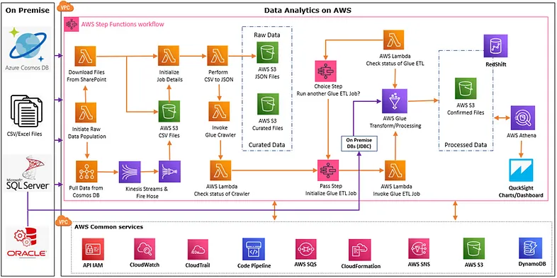
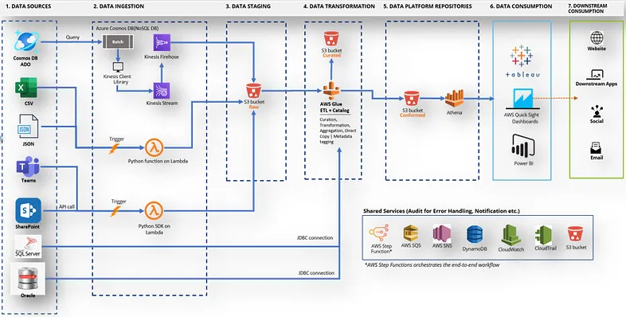

# Data Pipeline/Analytics framework using AWS Glue #
Creating Analytics application using AWS Glue and end to end workflow automation using AWS Step Functions.


## Introduction

The framework will help to collect the data from various repositories such as Flat files, RDBMS Databases and NO SQL databases. Flat files can be directly stored on S3 buckets using AWS FTP or S3 SDK/APIs while RDBMS databases can be directly connected to AWS Glue using JDBC connection and data from NO SQL databases such as ADO Cosmos DB or similar one can be collected through AWS Batch. Framework will first store data in “raw” bucket/folder which will be processed by ETL jobs where we can apply our mapping/transformation/filtration logic and will be stored into “curated” bucket/folders. Finally, data will be stored in “confirm/data” folder after applying required business logic using ETL confirm jobs. Framework will handle the whole workflow using AWS Step Functions by calling respective services in proper sequence and log each of the events in AWS DynamoDB table using AWS SQS asynchronous processing. Email notification will be sent out on the event of workflow success/failure.

## Reference AWS Architecture



## Reference Data Flow Diagram



#### Run below command to upload Glue ETL Job Scripts & Test CSV files.

```bash
cd copy-to-s3
aws --profile brijesh s3 sync . s3://glue-analytics-common-sourcebucket-rsqkpj8nhk7t/

```  

### Run below commands or cf\test-common.bat, cf\test-analytics.bat file to create SAM template file for CloudFormation deployments

```bash

aws cloudformation package --template-file common.yaml          --output-template-file  common-deploy.yaml    --s3-bucket    myworking-bucket  --profile brijesh --region us-east-2
aws cloudformation deploy  --template-file common-deploy.yaml   --stack-name            Glue-Analytics-Common --capabilities CAPABILITY_IAM  --profile brijesh --region us-east-2

aws cloudformation package --template-file analytics.yaml          --output-template-file  analytics-deploy.yaml  --s3-bucket myworking-bucket     --profile brijesh --region us-east-2
aws cloudformation deploy  --template-file analytics-deploy.yaml   --stack-name            Glue-Analytics         --capabilities CAPABILITY_IAM  --profile brijesh --region us-east-2

```  

#### Go to AWS console, search for Step functions, select XXX-Glue-Analytics and click on Start Execution


#### Notes:
- If we run the Crawler with only one file with single folder, it is not doing crawlering better way, instead it just creates single table with name 'json' only.
- When we have multiple folders with files, then it is able to create tables with proper table names. It will use folder names as table names.

### Want to know more in detail?

Go through below medium blog for step by step instructions and detailed guide.

https://medium.com/@brijesh_prajapati/data-pipeline-analytics-framework-using-aws-glue-b21e1e5e34cf